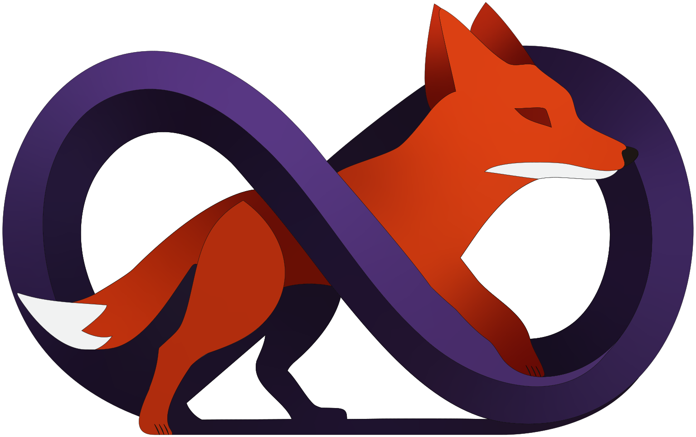

<div align="center">
  <br/>
  
  <br/>
  <br/>
  
  <h1>InfiniFox</h1>
  
  <p align="center">
    <strong>Image Generation Interface with Infinite Canvas so you can focus on what matters</strong>
    <br/>
    <em>Universal creative task UI with a modern design, cross-device support, and powerful editing capabilities, leveraging API to bring AI features right to the canvas</em>
  </p>
  
  <p align="center">
    <a href="#-features"></a>
    <a href="#-quick-start"></a>
    <a href="#-development"></a>
    <a href="https://github.com/CalamitousFelicitousness/InfiniFox/blob/main/LICENSE"></a>
  </p>
  
  <p align="center">
    <a href="https://konvajs.org/"></a>
    <a href="https://react.dev/"></a>
    <a href="https://www.typescriptlang.org/"></a>
    <a href="https://zustand-demo.pmnd.rs/"></a>
  </p>

  <br/>
  <!-- 
  Uncomment the following lines once interface screenshots are ready:
  <br/>
  
  <br/>
  <br/>
  -->
</div>

---

## 🎯 Overview

**InfiniFox** is a universal web interface for creative visuals, built from the ground up with artist requirements in mind. It aims to deliver a professional-grade experience through its infinite canvas system, sophisticated image editing, artboard support, and modular architecture to give the creator control over their workspace.

The core principle of InfiniFox is letting users focus on their creative work, without being distracted by the tool itself, with smart, contextual menus and a minimalist UI that only shows what you need when you need it, without sacrificing ease of use and functionality.

For AI-powered features it leverages its support of various APIs, including SD.Next, ComfyUI, and Automatic1111.

### Core Principles

- **🎨 User Experience** - Intuitive interface with professional-grade tools and workflows
- **📱 Universal Input** - Seamless support for mouse, touch, and pressure-sensitive stylus
- **🏗️ Modularity** - Component-based architecture for easy maintenance and extension
- **⚡ Performance** - Smooth canvas interactions with optimized rendering pipeline
- **🔧 Extensibility** - Plugin-ready architecture for custom features and backends
- **♿ Accessibility** - Embrace WCAG 2.1 AA and general accessibility best practices

---

## ✨ Features

### 🎨 Generation Capabilities

<table>
<tr>
<td width="33%" valign="top">

#### Text-to-Image

- Full parameter control
- Batch generation support
- Real-time preview
- Model/sampler selection
- Seed management
- CFG scale optimization

</td>
<td width="33%" valign="top">

#### Image-to-Image

- Drag-and-drop upload
- Denoising strength control
- Source image preservation
- Mask-based editing
- Resolution matching
- Batch transformations

</td>
<td width="33%" valign="top">

#### Inpainting

- Pressure-sensitive brushes
- Real-time mask preview
- Multiple fill modes
- Mask blur control
- Upload/download masks
- Undo/redo support

</td>
</tr>
</table>

### 🖼️ Infinite Canvas System

- **Creative workbench** - Your materials where you need them, at hand
- **High-Performance Rendering** - Konva.js-powered smooth interactions
- **Smart Viewport Management** - Efficient culling and lazy loading
- **Advanced Selection** - Multi-select, group operations, layer management
- **Transform Controls** - Resize, rotate, flip with visual handles
- **Context Actions** - Right-click menus with contextual options
- **Zoom & Pan** - Smooth navigation from 10% to 500% zoom

### 🛠️ Professional Tools

#### Drawing System

- **Perfect Freehand Integration** - Natural stroke dynamics
- **Pressure Sensitivity** - Full stylus/pen tablet support
- **LazyBrush Algorithm** - Intelligent smoothing and stabilization
- **Brush Presets** - Hard, soft, and watercolor-style brushes
- **Dynamic Sizing** - 1-100px with real-time preview

#### Filter Pipeline

- **40+ Custom Filters** - Professional-grade image adjustments
- **Non-Destructive Editing** - Preserve originals with live preview
- **Filter Chaining** - Combine multiple effects
- **WebAssembly Acceleration** - Near-native performance
- **GPU Processing** - Hardware-accelerated operations

### 📊 Workflow Management

<details>
<summary><b>Queue System</b></summary>

- Visual queue with drag-to-reorder
- Parallel and sequential processing
- Auto-retry with exponential backoff
- Progress tracking per item
- Priority management
- Resource optimization

</details>

<details>
<summary><b>History & Undo</b></summary>

- Command pattern architecture
- Visual history timeline
- Unlimited undo/redo
- State snapshots
- Selective rollback
- History export/import

</details>

<details>
<summary><b>Batch Processing</b></summary>

- Parameter matrix generation
- Seed incrementing strategies
- Prompt variations
- Resolution sweeps
- Model comparisons
- Export presets

</details>

---

## 🚀 Quick Start

### Prerequisites

Development stage uses SD.Next as the main backend. More API support coming soon.

- **Node.js** 18+ and npm
- **SD.Next** running with `--api` flag
- Modern browser (Chrome 90+, Firefox 88+, Safari 14+, Edge 90+)

### Installation

```bash
# Clone the repository
git clone https://github.com/CalamitousFelicitousness/InfiniFox.git
cd InfiniFox

# Install dependencies
npm install

# Start development server
npm run dev
```

The application will be available at `http://localhost:5173`

### Configuration

No configuration is required for the initial setup. All user configuration is handled through the UI.

---

## 💻 Development

### Project Structure

```markdown
InfiniFox/
├── 📁 src/
│   ├── 📁 api/              # API integration layer
│   ├── 📁 auth/             # Authentication system
│   ├── 📁 components/       # Reusable UI components
│   ├── 📁 features/         # Feature modules
│   │   ├── canvas/          # Infinite canvas system
│   │   ├── generation/      # Image generation
│   │   ├── filters/         # Filter pipeline
│   │   └── inpaint/         # Inpainting tools
│   ├── 📁 hooks/            # Custom React hooks
│   ├── 📁 services/         # Business logic
│   ├── 📁 store/            # State management
│   ├── 📁 types/            # TypeScript definitions
│   └── 📁 utils/            # Utility functions
├── 📁 docs/                 # Documentation
├── 📁 tests/                # Test suites
└── 📁 public/               # Static assets
```

### Available Scripts

| Command | Description |
|---------|-------------|
| `npm run dev` | Start development server with HMR |
| `npm run build` | Create production build |
| `npm run preview` | Preview production build |
| `npm run test` | Run test suite |
| `npm run lint` | Lint code with ESLint |
| `npm run format` | Format code with Prettier |
| `npm run type-check` | Validate TypeScript |

### Technology Stack

- **Frontend Framework**: React 18
- **Language**: TypeScript (strict mode)
- **Canvas Engine**: Konva.js
- **State Management**: Zustand
- **Styling**: CSS Modules + Tailwind utilities
- **Build Tool**: Vite
- **Testing**: Vitest + Testing Library
- **Input Handling**: Pointer Events API

---

## ⌨️ Keyboard Shortcuts

| Action | Windows/Linux | macOS |
|--------|--------------|-------|
| Generate | `Ctrl + Enter` | `⌘ + Enter` |
| Undo | `Ctrl + Z` | `⌘ + Z` |
| Redo | `Ctrl + Shift + Z` | `⌘ + Shift + Z` |
| Delete Selected | `Delete` | `Delete` |
| Duplicate | `Ctrl + D` | `⌘ + D` |
| Clear Canvas | `Ctrl + Shift + Delete` | `⌘ + Shift + Delete` |
| Save | `Ctrl + S` | `⌘ + S` |
| Select All | `Ctrl + A` | `⌘ + A` |

---

## Accessibility

### Principle

InfiniFox project also makes conscious choices for accessibility, so that no matter the skill level, familiarity, or whether user has disabilities or relies on assistive technologies, everyone can participate fully.

To achieve this the project strives to embrace WCAG 2.1 AA guidelines.

### Features

Here are accessibility features for InfiniFox in that format:

- **Keyboard Navigation**: Full keyboard support for all features
- **Screen Reader Support**: ARIA labels and live regions for canvas state changes
- **High Contrast and Colorblindness Mode**: Alternative color schemes for visual accomodation
- **Scalable UI**: Functional interface at any UI scaling level
- **Reduced Motion**: Respects prefers-reduced-motion for animations and transitions
- **Customizable Shortcuts**: Remappable keyboard shortcuts for motor accomodation
- **Large Click Targets**: Minimum 44x44px touch targets with adjustable sizing
- **Status Announcements**: Audio/visual feedback for generation progress and errors
- **Simplified Mode**: Streamlined interface option with essential controls only

---

## 📈 Roadmap

### Current Phase: Polish & Optimization

Focusing on perfecting existing features before adding new capabilities.

### ✅ Recently Completed

- Universal Pointer Events migration
- Pressure-sensitive stylus support
- Professional custom controls
- Filter pipeline system
- WebAssembly integration prep
- Enhanced drawing tools
- Authentication framework

### 🚧 In Progress

- Workspace management
- Layer management
- In-canvas inpainting
- Advanced brush engine
- Controlnet workflows support
- Improved UI, UX, and accessibility
- Streamlining parameter management
- Video playback and generation
- WebAssembly backend integration
- Advanced filter system
- Performance optimization for 4K+ images
- Comprehensive error handling
- Test coverage expansion (target: 80%)
- Bundle size optimization
- Accessibility improvements (WCAG 2.1 AA)

### 📅 Upcoming Features

<details>
<summary><b>Q1 2025</b></summary>

- [ ] ControlNet integration
- [ ] Model/LoRA management UI
- [ ] Canvas layers system
- [ ] Workflow automation
- [ ] Plugin API

</details>

<details>
<summary><b>Q2 2025</b></summary>

- [ ] Gallery view with tagging
- [ ] SDXL-specific parameters
- [ ] Regional prompting
- [ ] Animation support
- [ ] Cloud sync

</details>

<details>
<summary><b>Future</b></summary>

- [ ] Collaboration features
- [ ] Mobile application
- [ ] Desktop app (Electron)
- [ ] AI-assisted editing
- [ ] Video generation support

</details>

---

## 🤝 Contributing

Thank you for the interest! Opening up contributions and creation contribution guidelines might come in the future.

### Development Guidelines

- Follow TypeScript strict mode
- Maintain 80% test coverage
- Use functional components
- Implement proper error boundaries
- Follow accessibility standards
- Document public APIs

---

## 📚 Documentation

Currently awaiting feature completeness

---

## 📄 License

This project is licensed under the MIT License - see the [LICENSE](LICENSE) file for details.

---

## 🙏 Acknowledgments

Built with these excellent libraries:

- [Konva.js](https://konvajs.org/) - 2D Canvas framework
- [React](https://react.dev/) - UI library for web interfaces
- [SD.Next](https://github.com/vladmandic/sdnext) - Stable Diffusion backend
- [Perfect Freehand](https://github.com/steveruizok/perfect-freehand) - Drawing dynamics
- [Zustand](https://zustand-demo.pmnd.rs/) - State management

---
